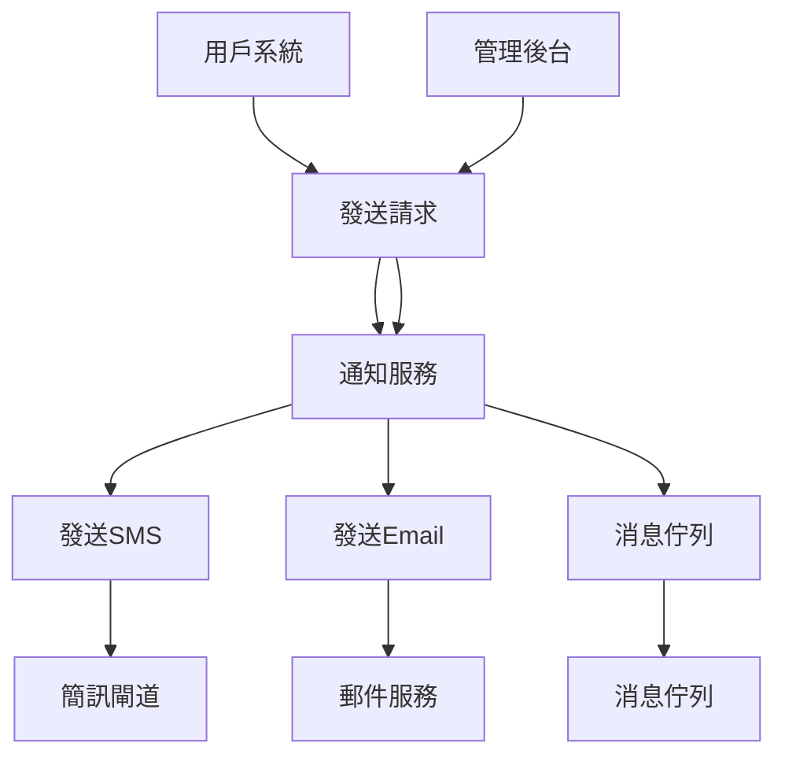
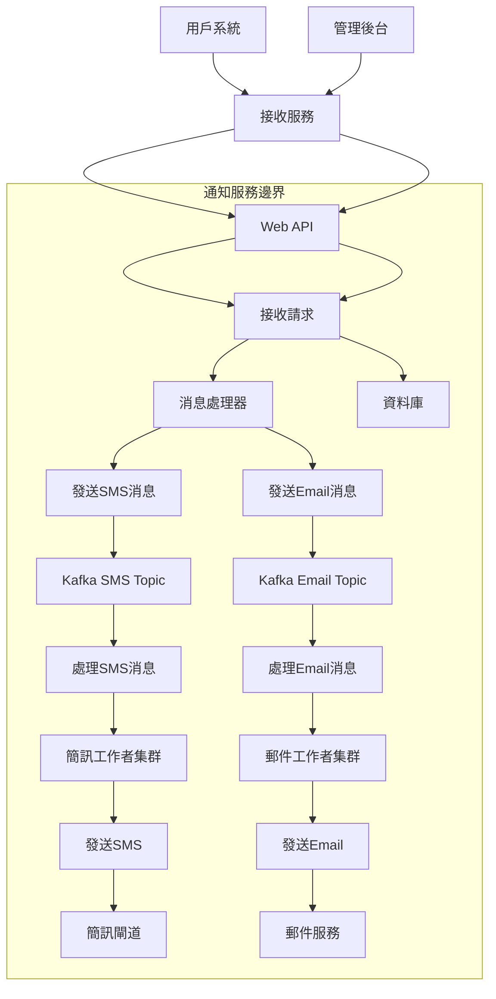
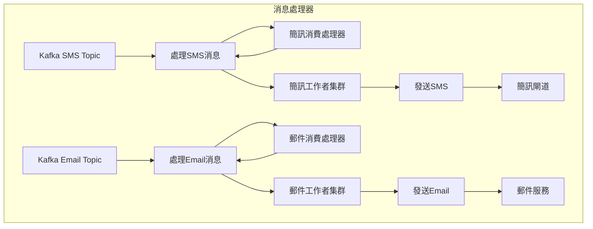

# 通知服務 C4 模型

> 通過 C4 模型可以清晰地理解和設計通知服務的架構

## 1. 上下文圖（Context Diagram）

上下文圖展示了系統與外部實體的交互關係，包括消息佇列的使用。



**作用**：展示系統與外部實體的交互關係，包括消息佇列。

## 2. 容器圖（Containers Diagram）

容器圖展示了系統內部的技術組成部分，包括消息佇列的使用。



**作用**：揭示系統內部運行時的技術組成部分，包括消息佇列的使用。

**技術規格**：

- 部署形態：Docker 容器/K8s 集群
- 通信協議：gRPC（使用 SSL/TLS 加密）
- 儲存引擎：PostgreSQL
- 消息佇列：Apache Kafka（使用 SMS 和 Email Topic）
- 技術棧：Go

## 3. 組件圖（Components Diagram）

組件圖展示了特定容器的實現細節，包括消息佇列的使用。



**作用**：展示容器的各個組件以及它們之間的關係。

## 4. 代碼圖（Code Diagram）

代碼圖使用 Go 語言實現的 Kafka 消息佇列消費者示例。

```go
package main

import (
    "context"
    "encoding/json"
    "fmt"
    "log"

    "github.com/Shopify/sarama"
)

type Message struct {
    Type string `json:"type"`
    Body string `json:"body"`
}

func main() {
    brokers := []string{"localhost:9092"}
    smsTopic := "sms_topic"
    emailTopic := "email_topic"
    groupID := "notification_group"

    config := sarama.NewConfig()
    config.Version = sarama.V2_0_0_0
    config.Consumer.Offsets.Initial = sarama.OffsetOldest
    config.Consumer.Offsets.AutoCommit.Enable = false

    // 增加消費者實例
    numSmsConsumers := 5
    numEmailConsumers := 5

    smsDone := make(chan bool, numSmsConsumers)
    emailDone := make(chan bool, numEmailConsumers)

    for i := 0; i < numSmsConsumers; i++ {
        go func() {
            consumeMessages(brokers, smsTopic, groupID, processSmsMessage)
            smsDone <- true
        }()
    }

    for i := 0; i < numEmailConsumers; i++ {
        go func() {
            consumeMessages(brokers, emailTopic, groupID, processEmailMessage)
            emailDone <- true
        }()
    }

    fmt.Println("等待所有消費者完成...")
    for i := 0; i < numSmsConsumers; i++ {
        <-smsDone
    }
    for i := 0; i < numEmailConsumers; i++ {
        <-emailDone
    }
    fmt.Println("所有消費者完成")
}

// 消費消息的通用函數
func consumeMessages(brokers []string, topic string, groupID string, processFunc func(string)) {
    consumerGroup, err := sarama.NewConsumerGroup(brokers, groupID, sarama.NewConfig())
    if err != nil {
        log.Fatalf("無法建立消費者群組: %v", err)
    }
    defer consumerGroup.Close()

    ctx := context.Background()

    for {
        err := consumerGroup.Consume(ctx, []string{topic}, &consumerHandler{processFunc: processFunc})
        if err != nil {
            log.Printf("消費消息時發生錯誤: %v", err)
            return
        }
    }
}

// 消費者處理器
type consumerHandler struct {
    processFunc func(string)
}

func (h *consumerHandler) Setup(_ sarama.ConsumerGroupSession) error   { return nil }
func (h *consumerHandler) Cleanup(_ sarama.ConsumerGroupSession) error { return nil }

func (h *consumerHandler) ConsumeClaim(session sarama.ConsumerGroupSession, claim sarama.ConsumerGroupClaim) error {
    for msg := range claim.Messages() {
        var message Message
        if err := json.Unmarshal(msg.Value, &message); err != nil {
            log.Printf("解析消息失敗: %v", err)
            continue
        }

        fmt.Printf("接收到消息: %s\n", message.Body)

        // 先發送簡訊或郵件
        if h.processFunc == processSmsMessage {
            if err := sendSms(message.Body); err != nil {
                log.Printf("發送簡訊失敗: %v", err)
                continue
            }
        } else if h.processFunc == processEmailMessage {
            if err := sendEmail(message.Body); err != nil {
                log.Printf("發送郵件失敗: %v", err)
                continue
            }
        }

        // 發送成功後提交偏移量
        session.MarkMessage(msg, "")
    }
    return nil
}

// 處理SMS消息
func processSmsMessage(body string) {
    fmt.Printf("處理SMS消息: %s\n", body)
}

// 處理Email消息
func processEmailMessage(body string) {
    fmt.Printf("處理Email消息: %s\n", body)
}

func sendSms(body string) error {
    // 實現簡訊發送邏輯
    return nil
}

func sendEmail(body string) error {
    // 實現郵件發送邏輯
    return nil
}

```

**作用**：展示具體的類、方法、變數等代碼元素，以及它們之間的關係。
